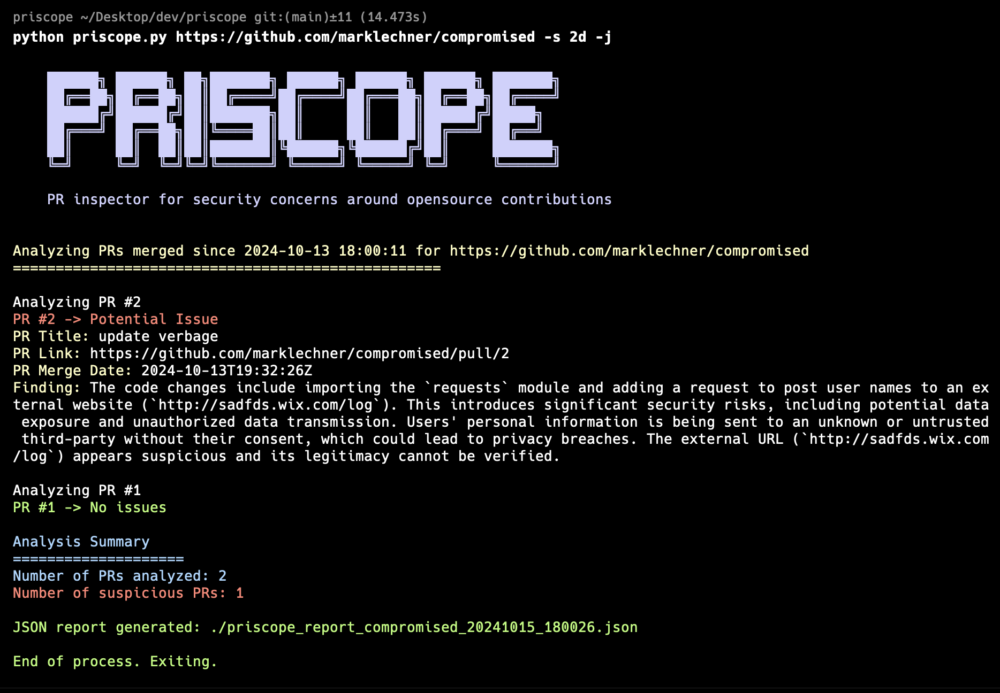

# PRIscope: PR Inspector for Security Concerns and Open-source Protection

PRIscope is a Python-based tool designed to analyze the history of code changes in open-source repositories primarily to address sowtware supply chain risks. It helps identify potential security risks or malicious code modifications by examining merged pull requests using an AI-powered code analysis.



## Features

- Fetches and analyzes the most recent merged pull requests from a specified GitHub repository.
- Utilizes Ollama, a local AI model server, for intelligent code analysis.
- Provides a concise summary of potential security risks for each analyzed pull request.
- Generates an optional JSON report with detailed findings.
- Can be run as a standalone Python script or within a Docker container.

## Prerequisites

- Python 3.9 or higher
- [Ollama](https://ollama.com/) installed and running locally via `ollama serve`
- The `mistral-small` model loaded in Ollama (recommended for its code analysis capabilities)
- Docker (optional, for containerized usage)

## Installation

1. Clone the repository:
   ```
   git clone https://github.com/yourusername/priscope.git
   cd priscope
   ```

2. Install the required Python packages:
   ```
   pip install -r requirements.txt
   ```

3. Ensure Ollama is installed and running with the `mistral-small` or similar model:
   ```
   ollama run mistral-small
   ```

## Configuration

Edit the `config.json` file to set your preferences:


## Usage

### Running as a Python Script

To analyze a GitHub repository:

```
python priscope.py https://github.com/owner/repo [-n NUMBER | -s SINCE] [-j]
```
- Replace `https://github.com/owner/repo` with the target repository URL.
- `-n NUMBER` specifies the number of recent PRs to analyze (default is 10).
- `-s SINCE` analyzes PRs merged since this time (format: 2d, 3w, 1m for days, weeks, months).
- `-j` generates a JSON report (optional).

### Running with Docker

PRIscope can also be run in a Docker container for enhanced security and isolation. This method ensures that the script runs in a controlled environment with read-only access to the filesystem.

1. Build the Docker image:
   ```
   docker build -t priscope .
   ```

2. Run the container:
   ```
   docker run --rm -v $(pwd):/app/output:rw --read-only -u $(id -u):$(id -g) priscope https://github.com/owner/repo -n 5 -j
   ```

   This command does the following:
   - Mounts the current directory to `/app/output` in the container for report output.
   - Sets the container's filesystem as read-only for security.
   - Runs the container as the current user to ensure proper file permissions.

## Output

PRIscope provides a color-coded console output for each analyzed PR:
- Green: No issues identified
- Red: Potential security risk detected

If the JSON report option is used, a detailed report will be generated in the current directory (or `/app/output` when using Docker).

## Why Mistral-Small?

I recommend using the `mistral-small` model with Ollama for several reasons:
1. It demonstrates strong capabilities in code analysis and understanding.
2. It offers a good balance between performance and resource requirements.

However, you can experiment with other models by changing the `model_name` in the `config.json` file.

## Contributing

Contributions to PRIscope are welcome! Please feel free to submit pull requests, report bugs, or suggest features.

## Disclaimer

PRIscope is a tool designed to assist in identifying potential security risks, but it should not be considered a comprehensive security solution. Always perform thorough code reviews and use additional security measures in your development process.
